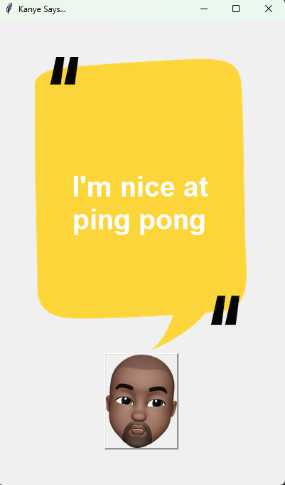

# Kanye Says...
## Description:
This project is a simple application that displays random quotes from Kanye West using an external API. It uses Tkinter for the GUI, and users can click a button to get a new quote displayed on the canvas.

## Installation:

Make sure you have Python installed on your system.
Install the required packages using pip:
Copy code:

`bash 
pip install requests`

## Usage:

Run the script:
 `bash 
kanye_says.py.`

Click the "Kanye" button to fetch a random quote.
The quote will be displayed on the canvas.
Project Structure:

kanye_says.py: The main script for the Kanye Says application.
background.png: Background image for the canvas.
kanye.png: Image for the "Kanye" button.
Screenshot:

## Credits:

API used: Kanye REST API
Libraries: requests for making HTTP requests, tkinter for the GUI.

# ISS Notifier
## Description:
This project is an automated ISS (International Space Station) notifier that sends an email if the ISS is overhead and it is nighttime at the user's location. It continuously checks the ISS position and local sunrise/sunset times using external APIs.

## Installation:

Make sure you have Python installed on your system.
Install the required packages using pip:
Copy code:

`bash 
pip install requests`

## Usage:

Set up a Gmail account for sending emails.
Update the MY_EMAIL and MY_PASSWORD variables with your Gmail credentials.
Run the script:

`bash 
iss_notifier.py. `

The script will run continuously in the background.
It will check if the ISS is overhead and if it is nighttime at your location.
If conditions are met, it will send an email notification.
Project Structure:

iss_notifier.py: The main script for the ISS Notifier application.
utils.py: Contains functions for checking ISS position and nighttime.
gmail.png: Placeholder image for sending emails (not used in actual script).

## Credits:

APIs used:
Open Notify API for ISS position.
Sunrise-Sunset API for sunrise/sunset times.
Libraries: requests for making HTTP requests, smtplib for sending emails.
Note:

This project demonstrates sending email notifications using Gmail. Make sure to enable "Less Secure Apps" in your Gmail settings or use an App Password if you have 2-factor authentication enabled.
Ensure the script runs continuously (e.g., using a server or a background process).
Remember to replace the MY_EMAIL and MY_PASSWORD variables with your own Gmail credentials for sending emails.
Enjoy your Kanye quotes and ISS notifications! 😎🛰️

## Developer 👩‍💻 
JennyLe